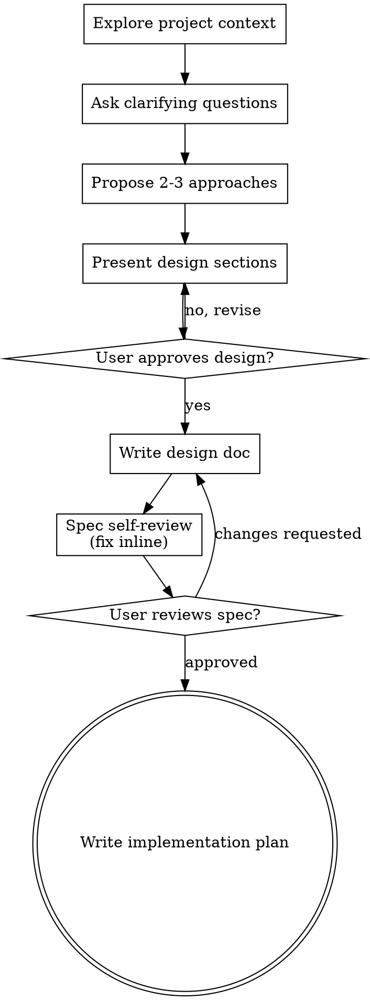

# Brainstorming ideas into designs

Adapted for this repository; see [provenance](PROVENANCE.md).

Help turn ideas into fully formed designs and specs through natural collaborative dialogue.

Start by understanding the current project context, then ask questions one at a time to refine an unapproved design.
Existing design approval and the user's authorization remain valid across handoffs.
When the design is already approved, follow its implementation plan without reopening approval.

<HARD-GATE>
Before implementing a new design, present it and obtain user approval.
An already approved design satisfies this gate.
Follow the current user instructions and approved repository plan.
</HARD-GATE>

## Anti-Pattern: "This Is Too Simple To Need A Design"

Every project goes through this process.
A todo list, a single-function utility, a config change, all of them.
"Simple" projects are where unexamined assumptions cause the most wasted work.
The design can be short (a few sentences for truly simple projects), but you MUST present it and get approval.

## Checklist

For a new, unapproved design, complete these steps in order.
For an approved design, use its existing plan and continue with the remaining work.

1. **Explore project context:** Check files, docs and recent commits.
2. **Ask clarifying questions:** Ask one question at a time about the purpose, constraints and success criteria.
3. **Propose 2-3 approaches:** Explain their trade-offs and recommend one.
4. **Present the design:** Scale the detail to its complexity and obtain approval.
5. **Write the design document:** Use the location and publication rules required by the repository plan.
6. **Review the spec:** Resolve placeholders, contradictions, ambiguity and scope issues.
7. **Review changes with the user:** Ask for review only when a changed design needs approval.
8. **Write the implementation plan:** Use an available plan-writing skill or the planning steps below.

## Process Flow

**The next step is implementation planning.**
Use an available plan-writing skill, or follow the planning steps below.
Do not invoke an implementation skill before the plan is ready.

## The Process

**Understanding the idea:**

- Check out the current project state first (files, docs, recent commits)
- Before asking detailed questions, assess scope: if the request describes multiple independent subsystems (e.g., "build a platform with chat, file storage, billing, and analytics"), flag this immediately.
  Don't spend questions refining details of a project that needs to be decomposed first.
- If the project is too large for a single spec, help the user decompose into sub-projects: what are the independent pieces, how do they relate, what order should they be built?
  Then brainstorm the first sub-project through the normal design flow.
  Each sub-project gets its own spec → plan → implementation cycle.
- For appropriately-scoped projects, ask questions one at a time to refine the idea
- Prefer multiple choice questions when possible, but open-ended is fine too
- Only one question per message - if a topic needs more exploration, break it into multiple questions
- Focus on understanding: purpose, constraints, success criteria

**Exploring approaches:**

- Propose 2-3 different approaches with trade-offs
- Present options conversationally with your recommendation and reasoning
- Lead with your recommended option and explain why
- YAGNI ruthlessly - remove unnecessary features from every approach and design

**Presenting the design:**

- Once you believe you understand what you're building, present the design
- Scale each section to its complexity: a few sentences if straightforward, up to 200-300 words if nuanced
- Ask after each section whether it looks right so far
- Cover: architecture, components, data flow, error handling, testing
- Be ready to go back and clarify if something doesn't make sense

**Design for isolation and clarity:**

- Break the system into smaller units that each have one clear purpose, communicate through well-defined interfaces, and can be understood and tested independently
- For each unit, you should be able to answer: what does it do, how do you use it, and what does it depend on?
- Can someone understand what a unit does without reading its internals?
  Can you change the internals without breaking consumers?
  If not, the boundaries need work.
- Smaller, well-bounded units are also easier for you to work with - you reason better about code you can hold in context at once, and your edits are more reliable when files are focused.
  When a file grows large, that's often a signal that it's doing too much.

**Working in existing codebases:**

- Explore the current structure before proposing changes.
  Follow existing patterns.
- Where existing code has problems that affect the work (e.g., a file that's grown too large, unclear boundaries, tangled responsibilities), include targeted improvements as part of the design - the way a good developer improves code they're working in.
- Don't propose unrelated refactoring.
  Stay focused on what serves the current goal.

## After the Design

**Documentation:**

- Write the validated design (spec) to the location required by the repository plan
- Use elements-of-style:writing-clearly-and-concisely skill if available
- Keep private design notes outside version control and follow the repository publication rules

**Spec Self-Review:** After writing the spec document, look at it with fresh eyes:

1. **Placeholder scan:** Any "TBD", "TODO", incomplete sections, or vague requirements?
   Fix them.
2. **Internal consistency:** Do any sections contradict each other?
   Does the architecture match the feature descriptions?
3. **Scope check:** Is this focused enough for a single implementation plan, or does it need decomposition?
4. **Ambiguity check:** Could any requirement be interpreted two different ways?
   If so, pick one and make it explicit.

Fix any issues inline.
No need to re-review, just fix and move on.

**User Review Gate:** For a new, unapproved design, ask the user to review the written spec before proceeding:

> "Review the design at `<path>` before implementation planning."

Wait for approval of a new design.
Apply requested changes and review the revised spec.
An existing approval satisfies this step; do not ask again.

**Implementation:**

1. Use an available plan-writing skill when it fits the repository workflow.
2. Otherwise, write a checkable plan in the repository's designated private task file.
3. Name the scoped files, dependencies, implementation steps and acceptance commands.
4. Include meaningful tests, affected documentation and independent verification.
5. Follow existing design approval and user authorization without adding another approval gate.
6. Hand the scoped plan to the implementation workflow.
